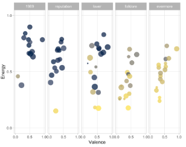
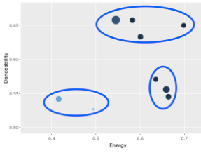
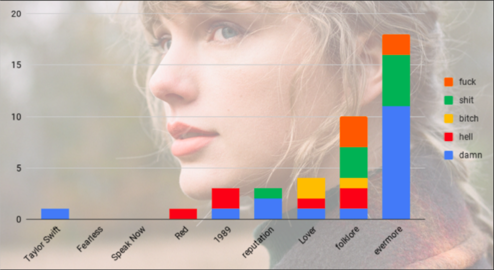

```{r setup, include=FALSE}

library(tidyverse)
library(spotifyr)
library(ggrepel)
library(compmus)
library(flexdashboard)
library(plotly)
library(DT)
library(grid)
library(gridExtra)
library(png)
library(tidymodels)
library(ggdendro)
library(heatmaply)
library(knitr)


get_conf_mat <- function(fit) {
  outcome <- .get_tune_outcome_names(fit)
  fit %>% 
    collect_predictions() %>% 
    conf_mat(truth = outcome, estimate = .pred_class)
}  

get_pr <- function(fit) {
  fit %>% 
    conf_mat_resampled() %>% 
    group_by(Prediction) %>% mutate(precision = Freq / sum(Freq)) %>% 
    group_by(Truth) %>% mutate(recall = Freq / sum(Freq)) %>% 
    ungroup() %>% filter(Prediction == Truth) %>% 
    select(class = Prediction, precision, recall)
}  

evermore <- get_playlist_audio_features("","4YtuQ3FLB2w27XFtgmzqU7")
folklore <- get_playlist_audio_features("","4YaaPhq4wawrxM0IqlCXc6")
lover <- get_playlist_audio_features("","1RnBW0qK769pfSuB1Euv4j")
reputation <- get_playlist_audio_features("","7rNUhp9UhkfIs8uHzfSpcS")
nine <- get_playlist_audio_features("","6dRkBAsWQaeYFPS0CVR0FU")
speaknow <- get_playlist_audio_features("","3nb8QcF2HRyvC2ncLjXwwW")
red <- get_playlist_audio_features("","4u9YPeH7Nsk6VMNrwIRW79")
fearless <- get_playlist_audio_features("","5uhG5PWE7CzuSI2eeyOwS3")
taylorswift <- get_playlist_audio_features("","6ojsDGC1I1WWnt4LyzqRnu")

albums <- bind_rows(evermore %>% 
                      mutate(category="evermore"),
                    folklore %>% 
                      mutate(category="folklore"),
                    lover %>% 
                      mutate(category="lover"),
                    reputation %>% 
                      mutate(category="reputation"),
                    nine %>% 
                      mutate(category="1989"),
                    red %>% 
                      mutate(category="red"),
                    speaknow %>% 
                      mutate(category="speaknow"),
                    fearless %>% 
                      mutate(category="fearless"),
                    taylorswift %>% 
                      mutate(category="taylorswift"))

everlore <- bind_rows(evermore %>% 
                      mutate(category="evermore"),
                    folklore %>% 
                      mutate(category="folklore"))

albums.means <- 
  albums %>%
  group_by(playlist_name) %>%
  summarise(
    mean_danceability = mean(danceability),
    mean_acousticness = mean(acousticness),
    mean_energy = mean(energy))


albums.sd <- 
  albums %>%
  group_by(playlist_name) %>%
  summarise(
    sd_danceability = sd(danceability),
    sd_acousticness = sd(acousticness),
    sd_energy = sd(energy))

albums.sd.means <- merge(albums.sd,albums.means,by="playlist_name")
albums.sd.means2 <- if(is.numeric(albums.sd.means)) round(albums.sd.means,digits = 2)


```


### **Introduction page**, get to know my corpus!
:::: {style="display: flex;"}

::: {}
**The 180 degree turn of Taylor Swift**

*My corpus will be about the change that Taylor Swift has been through stylisticly throughout her recent albums.*

In July 2020 she suddenly released her eight record, called **'folklore'**, which was a 180 degree turn from the (pop) sound she used to make. With the record she went back to her country roots and critics called it her best work yet. I was not the biggest Swift fan before this record dropped, but folklore changed the game for me. Every single song on the record is so beautifully written and it became my most listened to album of 2020. Taylor herself was also inspired by this sudden change in her style, and just 5 months later she released folklore's 'sister record' called **'evermore'** in december. Where she used to have a big roll-out for a new record and where there would be a couple of years between them to build up hype, these two records were announced the day before they were released. Both folklore and evermore are now considered her two best records she ever made, and I can't stop myself from listening to them over and over again. 

<div>

</div>

**Because these two records were such a big change in style for Taylor, I think it would be really interesting to compare them to her earlier work and see if the songs are actually as different as I believe them to be. Or maybe this sound was always hidden away in her bubblegum pop records of the past and it just never showed? **
:::

::: {}

:::

::::

### Comparing **every single record** she released since the start of her career. Which ones are more **danceable**? And which ones are more **acoustic**?

```{r, cashe = TRUE}
albums.sp.energy <- albums.sd.means %>%
  ggplot(aes(mean_energy,mean_danceability,
             color = as.numeric(as.character(mean_acousticness)),
             size = sd_danceability + sd_energy + sd_acousticness,
             text = paste0(
               "Album : ",playlist_name,
               "<br>Energy : ",round(mean_energy,digits=2),
               "<br>Danceability : ",round(mean_danceability,digits=2),
               "<br>Acousticness : ",round(mean_acousticness,digits=2),
               "<br>SD Energy : ",round(sd_energy,digits=2),
               "<br>SD Danceability : ",round(sd_danceability,digits=2),
               "<br>SD Acousticness : ",round(sd_acousticness,digits=2)
             )))  + geom_point() + expand_limits(x=c(0.35,0.75), y=c(0.5,0.675))  + labs(y= "Danceability", x = " Energy",color="Acousticness",size="SD Danceability",alpha = "SD Energy",title = "Every Taylor Swift record, mapped out.") 


ggplotly(albums.sp.energy,tooltip = "text") 

```

***
**The first thing** I wanted to do, was just compare every album she released and observe where differences lie, so I'm not biased by knowing that her two most recent albums are in fact very different from the other ones that she has put out so far. 

When hovering over the dots in the graph, you can see the respective names of the albums together with how the album scores on three categories; danceability, energy and acousticness. **Immediately** you see folklore and evermore in their own corner, with especially 1989 (her most successful album chart-wise) in the complete opposite. Her two latest albums also show a difference in acousticness as they are a lighter blue than the other ones. I think this is a good starting point for further comparisons. 

And if you were wondering: **"What about the size of the dots?!"** Well, this is actually calculated by how diverse the album is. I added up the standard deviations of the variables used in this plot. The bigger that number is, the bigger the dot. The tracks on 'evermore', for example, are all pretty similar. Whereas the tracks on "Lover" differ the most. 


### Diving into her **5 most recent albums** to find out when this **sudden change in style** happened. 

```{r, cashe = TRUE}
ef1989 <-
  evermore %>%
  mutate(category = "evermore") %>%
  bind_rows(folklore %>% mutate(category = "folklore")) %>%
  bind_rows(reputation %>% mutate(category = "reputation")) %>%
  bind_rows(lover %>% mutate(category = "lover")) %>%
  bind_rows(nine %>% mutate(category = "1989")) %>%
  mutate(
    category = fct_relevel(category, "1989", "reputation", "lover","folklore","evermore")
  )
outliers <-
  ef1989 %>%
  ggplot(                          # Set up the plot.
    aes(
      x = valence,
      y = energy,
      colour = acousticness,
      size = danceability,
      label = track.name          # Labels will be interactively visible.
    )
  ) +
  geom_point() +                   # Scatter plot.
  facet_wrap(~category,nrow=1) +           # Separate charts per country.
  scale_x_continuous(              # Fine-tune the x axis.
    limits = c(0,1, 1),
    breaks = c(0, 0.50, 1),        # Use grid-lines for quadrants only.
    minor_breaks = NULL            # Remove 'minor' grid-lines.
  ) +
  scale_y_continuous(              # Fine-tune the y axis in the same way.
    limits = c(0, 1),
    breaks = c(0, 0.50, 1),
    minor_breaks = NULL
  ) +
  scale_colour_viridis_c(          # Use the cividis palette
    option = "E",                  # Qualitative set.
    alpha = 0.8,                   # Include some transparency
    guide = "none"
  ) +
  scale_size_continuous(           # Fine-tune the sizes of each point.
    guide = "none"                 # Remove the legend for size.
  ) +
  theme_light() +                  # Use a simpler theme.
  labs(                            # Make the titles nice.
    x = "Valence",
    y = "Energy"
  )

outliers
```

***
I decided to **continue this journey of comparison** with her five most recent albums. The graphs are ordered from oldest to newest starting with '1989' (released in 2014) and ending with 'evermore' (released in 2020). In these graphs, **size is determined by the danceability** of the track and color is determined by acousticness. **The more yellow the dot, the more acoustic the track.** 

Looking at these graphs side to side, the fact that 'evermore' and 'foklore' are called **"sister-albums"** becomes even more clear. There is also a clear **downward trend** when it comes to energy from '1989' to 'folklore'. But **the most sudden changes** seperating the two sister-albums from their predecessors are found in acousticness and danceability. On average, the dots of 'folklore' and 'evermore' are smaller and more yellow. 

Comparing the means side-to-side makes this even more clear. There has been a big change of style in Swifts work going from 'Lover' to 'evermore'.

```{r, cashe = TRUE}
albums.means2 <-
  ef1989 %>%
  group_by(playlist_name) %>%
  summarise(
    mean_acousticness = mean(acousticness),
    mean_energy = mean(energy),
    mean_danceability = mean(danceability)) %>%
  arrange(mean_acousticness)

library(knitr)
kable(albums.means2, col.names = c('Album', 'Acoustic', 'Energy','Dance'),digits=2)
```

**In the next few pages**, I am going to compare two tracks using so-called "track level features". This basically means zooming in on the tracks and searching for **differences concerning the structure,key and timbre**. I decided to use one track from '1989' and one from 'evermore' because they are the most different and the furthest apart in terms of the years they were released. **The tracks I chose** are "Blank Space" for '1989' and "Ivy" for 'evermore' because they lie near the mean of both albums, and are therefore good representatives. 

### Is there a difference concercing the **timbre** of the tracks? A closer look using the **Spotify Timbre Coefficients**.  
```{r, cashe = TRUE}
evermore <-
  get_playlist_audio_features(
    "",
    "4YtuQ3FLB2w27XFtgmzqU7"
  ) %>%
  slice(1:30) %>%
  add_audio_analysis()
ninetie <-
  get_playlist_audio_features(
    "",
    "6dRkBAsWQaeYFPS0CVR0FU"
  ) %>%
  slice(1:30) %>%
  add_audio_analysis()
jazz <-
  evermore %>%
  mutate(album = "evermore") %>%
  bind_rows(ninetie %>% mutate(album = "1989"))


blank.cep <-
  get_tidy_audio_analysis("2ls70nUDfjzm1lSRDuKxmw") %>% # Change URI.
  compmus_align(bars, segments) %>%                     # Change `bars`
  select(bars) %>%                                      #   in all three
  unnest(bars) %>%                                      #   of these lines.
  mutate(
    pitches =
      map(segments,
        compmus_summarise, pitches,
        method = "rms", norm = "euclidean"              # Change summary & norm.
      )
  ) %>%
  mutate(
    timbre =
      map(segments,
        compmus_summarise, timbre,
        method = "rms", norm = "euclidean"              # Change summary & norm.
      )
  )

ivy.cep <-
  get_tidy_audio_analysis("43Ykum9T72UOPhBN31grpN") %>% # Change URI.
  compmus_align(bars, segments) %>%                     # Change `bars`
  select(bars) %>%                                      #   in all three
  unnest(bars) %>%                                      #   of these lines.
  mutate(
    pitches =
      map(segments,
        compmus_summarise, pitches,
        method = "rms", norm = "euclidean"              # Change summary & norm.
      )
  ) %>%
  mutate(
    timbre =
      map(segments,
        compmus_summarise, timbre,
        method = "rms", norm = "euclidean"              # Change summary & norm.
      )
  )

plot1 <- blank.cep %>%
  compmus_gather_timbre() %>%
  ggplot(
    aes(
      x = start + duration / 2,
      width = duration,
      y = basis,
      fill = value
    )
  ) +
  geom_tile() +
  labs(x = "Time (s)", y = NULL, fill = "Magnitude",title = "Blank Space") +
  scale_fill_viridis_c(guide="none") +                              
  theme_classic()

plot2 <- ivy.cep %>%
  compmus_gather_timbre() %>%
  ggplot(
    aes(
      x = start + duration / 2,
      width = duration,
      y = basis,
      fill = value
    )
  ) +
  geom_tile() +
  labs(x = "Time (s)", y = NULL, fill = "Magnitude",title = "Ivy") +
  scale_fill_viridis_c(guide = "none") +                              
  theme_classic()

plot3 <- jazz %>%
  mutate(
    timbre =
      map(
        segments,
        compmus_summarise,
        timbre,
        method = "mean"
      )
  ) %>%
  select(album, timbre) %>%
  compmus_gather_timbre() %>%
  ggplot(aes(x = basis, y = value, color = album)) +
geom_point()+
  scale_fill_viridis_d(guide="none") +
  labs(x = "Spotify Timbre Coefficients", y = "",color="") + theme(legend.position = "top")

grid.arrange(arrangeGrob(plot1,plot2),plot3,nrow=1,ncol=2)
```

***

**Used tracks :** 
[Blank Space](https://open.spotify.com/track/1u8c2t2Cy7UBoG4ArRcF5g?si=Svk9cWhlQ-SHHQWdTas2Gw) , from her fifth studio album '1989'.
[Ivy](https://open.spotify.com/track/19CSr8rwW05VJL2F91KFNK?si=IGagf0C_SoaJuMJr6fiPnQ), from her ninth studio album 'evermore'.

In these graphs, I tried to find a **difference in timbre** between the two albums '1989' and 'evermore'. On the left, you can see a so-called **"Cepstogram"** of the two representative tracks. It looks a bit vague, but the only thing that is important is that it shows **changes in the song concercing timbre.** The different coefficients (c01-c12) all stand for different levels of timbre. Although the exact definitions are not well-defined; c01 is known to be 'loudness', c02 stands for the low frequencies, c03 represents the mid range and c04 stands for 'noise'. The other levels are not that clear and also less and less visible. 

Looking at these tracks, **Blank Space** stays much more in the low frequencies, while **Ivy** tends to explore other levels of timbre. This distinction on c02 level is even more visible when looking at the two albums overall. In the graph on the right, I summarized the Timbre Coefficients of every track and the mean of every track per coefficient is shown in the graph. 

### How consistent are **Blank Space** and **Ivy** when it comes to the use of different **pitch classes**?
```{r, cashe = TRUE}
blank <-
  get_tidy_audio_analysis("2ls70nUDfjzm1lSRDuKxmw") %>%
  select(segments) %>%
  unnest(segments) %>%
  select(start, duration, pitches)

ivy <-
  get_tidy_audio_analysis("43Ykum9T72UOPhBN31grpN") %>%
  select(segments) %>%
  unnest(segments) %>%
  select(start, duration, pitches)


plot1x <- blank %>%
  mutate(pitches = map(pitches, compmus_normalise, "euclidean")) %>%
  compmus_gather_chroma() %>% 
  ggplot(
    aes(
      x = start + duration / 2,
      width = duration,
      y = pitch_class,
      fill = value
    ) 
   ) +
  geom_tile() +
  labs(x = "Time (s)", y = NULL, title = "Blank Space", fill = "Magnitude") +
  theme_minimal() +
  scale_fill_viridis_c() + 
  geom_vline(xintercept=48, color = "white")+
 geom_vline(xintercept=88, color = "white")+
geom_vline(xintercept=130, color = "white")+
 geom_vline(xintercept=172, color = "white")+
  geom_text(x=105, y="G", label="Chorus", color = "white")+
  geom_text(x=189, y="G", label="Chorus", color = "white")+
  geom_segment(x = 110, y = "G#|Ab", xend = 90, yend = "G#|Ab",
                  arrow=arrow(length=unit(0.15,"cm")), colour="white")+
  geom_segment(x = 194, y = "G#|Ab", xend = 174, yend = "G#|Ab",
                  arrow=arrow(length=unit(0.15,"cm")), colour="white")


plot2x <- ivy %>%
  mutate(pitches = map(pitches, compmus_normalise, "euclidean")) %>%
  compmus_gather_chroma() %>% 
  ggplot(
    aes(
      x = start + duration / 2,
      width = duration,
      y = pitch_class,
      fill = value
    )
  ) +
  geom_tile() +
  labs(x = "Time (s)", y = NULL, title = "Ivy", fill = "Magnitude") +
  theme_minimal() +
  scale_fill_viridis_c(guide = "none")


grid.arrange(plot1x,plot2x)
```

***

**Used tracks :** 
[Blank Space](https://open.spotify.com/track/1u8c2t2Cy7UBoG4ArRcF5g?si=Svk9cWhlQ-SHHQWdTas2Gw) , from her fifth studio album '1989'. 
[Ivy](https://open.spotify.com/track/19CSr8rwW05VJL2F91KFNK?si=IGagf0C_SoaJuMJr6fiPnQ), from her ninth studio album 'evermore'.

Here you see a so-called chromagram of the two songs. This tells you what pitch class is most prominent in a given time frame. As you can see, in **Blank Space**, there seems to be a clear chorus at the places with an "M" visible at the F and G pitch class. While in **Ivy**, it's a lot more consistent on the D, with lots of other pitch classes being played alongside. 

This could be a result of the **increased acousticness** of the tracks on both folklore and evermore, which we saw in the side-by-side comparison of her five most recent albums. 

<div>

</div>

Because her two latest records are mostly recorded acousticly, without a lot computer sounds and edits, the chords could be less clearly visible. 

### Taking a closer look at the overall **structure of the tracks**. Did Swift start writing songs outside of the **pop-formula**?
```{r, cashe = TRUE}
blank_self <-
  get_tidy_audio_analysis("2ls70nUDfjzm1lSRDuKxmw") %>% # Change URI.
  compmus_align(sections, segments) %>%                     # Change `bars`
  select(sections) %>%                                      #   in all three
  unnest(sections) %>%                                      #   of these lines.
  mutate(
    pitches =
      map(segments,
        compmus_summarise, pitches,
        method = "mean", norm = "euclidean"              # Change summary & norm.
      )
  ) %>%
  mutate(
    timbre =
      map(segments,
        compmus_summarise, timbre,
        method = "mean", norm = "euclidean"              # Change summary & norm.
      )
  )

shake_self <-
  get_tidy_audio_analysis("0cqRj7pUJDkTCEsJkx8snD") %>% # Change URI.
  compmus_align(sections, segments) %>%                     # Change `bars`
  select(sections) %>%                                      #   in all three
  unnest(sections) %>%                                      #   of these lines.
  mutate(
    pitches =
      map(segments,
        compmus_summarise, pitches,
        method = "mean", norm = "euclidean"              # Change summary & norm.
      )
  ) %>%
  mutate(
    timbre =
      map(segments,
        compmus_summarise, timbre,
        method = "mean", norm = "euclidean"              # Change summary & norm.
      )
  )

style_self <-
  get_tidy_audio_analysis("0ug5NqcwcFR2xrfTkc7k8e") %>% # Change URI.
  compmus_align(sections, segments) %>%                     # Change `bars`
  select(sections) %>%                                      #   in all three
  unnest(sections) %>%                                      #   of these lines.
  mutate(
    pitches =
      map(segments,
        compmus_summarise, pitches,
        method = "mean", norm = "euclidean"              # Change summary & norm.
      )
  ) %>%
  mutate(
    timbre =
      map(segments,
        compmus_summarise, timbre,
        method = "mean", norm = "euclidean"              # Change summary & norm.
      )
  )

season_self <-
  get_tidy_audio_analysis("6sQckd3Z8NPxVVKUnavY1F") %>% # Change URI.
  compmus_align(sections, segments) %>%                     # Change `bars`
  select(sections) %>%                                      #   in all three
  unnest(sections) %>%                                      #   of these lines.
  mutate(
    pitches =
      map(segments,
        compmus_summarise, pitches,
        method = "mean", norm = "euclidean"              # Change summary & norm.
      )
  ) %>%
  mutate(
    timbre =
      map(segments,
        compmus_summarise, timbre,
        method = "mean", norm = "euclidean"              # Change summary & norm.
      )
  )

ivy_self <-
  get_tidy_audio_analysis("43Ykum9T72UOPhBN31grpN") %>% # Change URI.
  compmus_align(sections, segments) %>%                     # Change `bars`
  select(sections) %>%                                      #   in all three
  unnest(sections) %>%                                      #   of these lines.
  mutate(
    pitches =
      map(segments,
        compmus_summarise, pitches,
        method = "mean", norm = "euclidean"              # Change summary & norm.
      )
  ) %>%
  mutate(
    timbre =
      map(segments,
        compmus_summarise, timbre,
        method = "mean", norm = "euclidean"              # Change summary & norm.
      )
  )

willow_self <-
  get_tidy_audio_analysis("2gVhfX2Gy1T9kDuS9azrF7") %>% # Change URI.
  compmus_align(sections, segments) %>%                     # Change `bars`
  select(sections) %>%                                      #   in all three
  unnest(sections) %>%                                      #   of these lines.
  mutate(
    pitches =
      map(segments,
        compmus_summarise, pitches,
        method = "mean", norm = "euclidean"              # Change summary & norm.
      )
  ) %>%
  mutate(
    timbre =
      map(segments,
        compmus_summarise, timbre,
        method = "mean", norm = "euclidean"              # Change summary & norm.
      )
  )


plot1 <- blank_self %>%
  compmus_self_similarity(timbre, "cosine") %>% 
  ggplot(
    aes(
      x = xstart + xduration / 2,
      width = xduration,
      y = ystart + yduration / 2,
      height = yduration,
      fill = d
    )
  ) +
  geom_tile() +
  coord_fixed() +
  scale_fill_viridis_c(guide = "none") +
  theme_classic() +
  labs(x = "", y = "",
      title = "Blank Space")

plot2 <- shake_self %>%
  compmus_self_similarity(timbre, "cosine") %>% 
  ggplot(
    aes(
      x = xstart + xduration / 2,
      width = xduration,
      y = ystart + yduration / 2,
      height = yduration,
      fill = d
    )
  ) +
  geom_tile() +
  coord_fixed() +
  scale_fill_viridis_c(guide = "none") +
  theme_classic() +
  labs(x = "", y = "",
      title = "Shake It Off")

plot3 <- style_self %>%
  compmus_self_similarity(timbre, "cosine") %>% 
  ggplot(
    aes(
      x = xstart + xduration / 2,
      width = xduration,
      y = ystart + yduration / 2,
      height = yduration,
      fill = d
    )
  ) +
  geom_tile() +
  coord_fixed() +
  scale_fill_viridis_c(guide = "none") +
  theme_classic() +
  labs(x = "", y = "",
      title = "Style")

plot4 <- season_self %>%
  compmus_self_similarity(timbre, "cosine") %>% 
  ggplot(
    aes(
      x = xstart + xduration / 2,
      width = xduration,
      y = ystart + yduration / 2,
      height = yduration,
      fill = d
    )
  ) +
  geom_tile() +
  coord_fixed() +
  scale_fill_viridis_c(guide = "none") +
  theme_classic() +
  labs(x = "", y = "",
      title = "damn season")

plot5 <- ivy_self %>%
  compmus_self_similarity(timbre, "cosine") %>% 
  ggplot(
    aes(
      x = xstart + xduration / 2,
      width = xduration,
      y = ystart + yduration / 2,
      height = yduration,
      fill = d
    )
  ) +
  geom_tile() +
  coord_fixed() +
  scale_fill_viridis_c(guide = "none") +
  theme_classic() +
  labs(x = "", y = "",
      title = "ivy")

plot6 <- willow_self %>%
  compmus_self_similarity(timbre, "cosine") %>% 
  ggplot(
    aes(
      x = xstart + xduration / 2,
      width = xduration,
      y = ystart + yduration / 2,
      height = yduration,
      fill = d
    )
  ) +
  geom_tile() +
  coord_fixed() +
  scale_fill_viridis_c(guide = "none") +
  theme_classic() +
  labs(x = "", y = "",
      title = "willow")

grid.arrange(plot1,plot2,plot3,plot4,plot5,plot6,nrow=2,ncol=3)

```

***

**Used tracks :** 
[Blank Space](https://open.spotify.com/track/1u8c2t2Cy7UBoG4ArRcF5g?si=Svk9cWhlQ-SHHQWdTas2Gw), [Shake It Off](https://open.spotify.com/track/0cqRj7pUJDkTCEsJkx8snD?si=T8WLGlomRJayEoZMJmkZtw) and [Style](https://open.spotify.com/track/0ug5NqcwcFR2xrfTkc7k8e?si=NFRs_w3pQsubezMOAbxliA), from her fifth studio album '1989'. 

['tis the damn season](https://open.spotify.com/track/6sQckd3Z8NPxVVKUnavY1F?si=MAczwP-aT4aGjI0tvY9vsA), [ivy](https://open.spotify.com/track/43Ykum9T72UOPhBN31grpN?si=iBALIPODT4KGBfocuslbew) and [willow](https://open.spotify.com/track/2gVhfX2Gy1T9kDuS9azrF7?si=XntLdqcqTCCNztuQCphkaA), from her ninth studio album 'evermore'.

As you can see, I made **self-similarity matrices** based on timbre. Which, for those of you who are not familiar with these kinds of graphs, is just a way to see the over-all structure of the song. And with structure i mean the positions of chorus, verse and maybe a bridge or different change in the song itself. 

The first row contains three songs from one of her most popular albums, **1989**, and the second row shows three songs from her most recent album, **evermore**. In every track from 1989, you see Swift holding on to the **'pop-structure'** which simply means intro-verse-chorus-verse-chorus-bridge-chorus-end. But with the songs from evermore it is clearly visible that the structure of the songs is very different from the ones seen in the 1989 songs. The structure is more experimental / alternative, with some kind of chorus visible (obviously) but it is not as clear in Blank Space, Shake It Off and Style. 

What I understood of this matrix, **is the busier the graph: the more diverse the song.** And 'tis the damn season, ivy and willow definitely have the busiest matrices. Which to me seems like **Taylor Swift started to experiment** more with the structure of the songs, moving away from the standard pop-structure seen in her previous albums. 

### Just like with structure, Taylor also started experimenting with **tempo**. A tempogram of the **title-track of 'evermore'**.
```{r, cashe = TRUE}
evermore <- get_tidy_audio_analysis("6Wlq9rqkxrqj5Kls4Kw14H")


evermore %>%
  tempogram(window_size = 8, hop_size = 1, cyclic = TRUE) %>%
  ggplot(aes(x = time, y = bpm, fill = power)) +
  geom_raster() +
  scale_fill_viridis_c(guide = "none") +
  labs(x = "Time (s)", y = "Tempo (BPM)",title="evermore ft. Bon Iver") +
  theme_classic() + xlim(0,290) + 
  geom_vline(xintercept=158, color = "white")+ 
  geom_vline(xintercept=222, color = "white")+
  geom_text(x=190, y=140, label="Bon Iver comes in", color = "white", size=3.2)
```

***

**Used track :** 
[evermore (ft. Bon Iver)](https://open.spotify.com/track/6Wlq9rqkxrqj5Kls4Kw14H?si=YzDu5Y4PSMib2YpDaf4OCQ) , from her ninth studio album 'evermore'.

On the last page there already was a clear difference in structure between Swift's newer and older albums. It looks like she abandoned the standard pop-structure and started to experiment more while writing her songs. Besides structure, she also started to experiment with tempo. Because **for the first time in her career**, she incorporated a **change in tempo** in one of her songs. I'm talking about the title track of 'evermore', of which you see a so-called tempogram in the graph on the left.

This change in tempo is **clearly visible in this tempogram**. The song features Bon Iver's singer Justin Vernon, and when Taylor stops singing and Justin starts you see the tempo jumping up from 100bpm to 120bpm. This is pretty unique for Swift,  and the first time she does not hold on to tempo for the entirety of a song (which is one of the core-principles of pop music).

### Trying to find differences when looking at **key changes** using the "Keygram". 

```{r, cashe = TRUE}
circshift <- function(v, n) {
  if (n == 0) v else c(tail(v, n), head(v, -n))
}

#      C     C#    D     Eb    E     F     F#    G     Ab    A     Bb    B
major_chord <-
  c(   1,    0,    0,    0,    1,    0,    0,    1,    0,    0,    0,    0)
minor_chord <-
  c(   1,    0,    0,    1,    0,    0,    0,    1,    0,    0,    0,    0)
seventh_chord <-
  c(   1,    0,    0,    0,    1,    0,    0,    1,    0,    0,    1,    0)

major_key <-
  c(6.35, 2.23, 3.48, 2.33, 4.38, 4.09, 2.52, 5.19, 2.39, 3.66, 2.29, 2.88)
minor_key <-
  c(6.33, 2.68, 3.52, 5.38, 2.60, 3.53, 2.54, 4.75, 3.98, 2.69, 3.34, 3.17)

chord_templates <-
  tribble(
    ~name, ~template,
    "Gb:7", circshift(seventh_chord, 6),
    "Gb:maj", circshift(major_chord, 6),
    "Bb:min", circshift(minor_chord, 10),
    "Db:maj", circshift(major_chord, 1),
    "F:min", circshift(minor_chord, 5),
    "Ab:7", circshift(seventh_chord, 8),
    "Ab:maj", circshift(major_chord, 8),
    "C:min", circshift(minor_chord, 0),
    "Eb:7", circshift(seventh_chord, 3),
    "Eb:maj", circshift(major_chord, 3),
    "G:min", circshift(minor_chord, 7),
    "Bb:7", circshift(seventh_chord, 10),
    "Bb:maj", circshift(major_chord, 10),
    "D:min", circshift(minor_chord, 2),
    "F:7", circshift(seventh_chord, 5),
    "F:maj", circshift(major_chord, 5),
    "A:min", circshift(minor_chord, 9),
    "C:7", circshift(seventh_chord, 0),
    "C:maj", circshift(major_chord, 0),
    "E:min", circshift(minor_chord, 4),
    "G:7", circshift(seventh_chord, 7),
    "G:maj", circshift(major_chord, 7),
    "B:min", circshift(minor_chord, 11),
    "D:7", circshift(seventh_chord, 2),
    "D:maj", circshift(major_chord, 2),
    "F#:min", circshift(minor_chord, 6),
    "A:7", circshift(seventh_chord, 9),
    "A:maj", circshift(major_chord, 9),
    "C#:min", circshift(minor_chord, 1),
    "E:7", circshift(seventh_chord, 4),
    "E:maj", circshift(major_chord, 4),
    "G#:min", circshift(minor_chord, 8),
    "B:7", circshift(seventh_chord, 11),
    "B:maj", circshift(major_chord, 11),
    "D#:min", circshift(minor_chord, 3)
  )

key_templates <-
  tribble(
    ~name, ~template,
    "Gb:maj", circshift(major_key, 6),
    "Bb:min", circshift(minor_key, 10),
    "Db:maj", circshift(major_key, 1),
    "F:min", circshift(minor_key, 5),
    "Ab:maj", circshift(major_key, 8),
    "C:min", circshift(minor_key, 0),
    "Eb:maj", circshift(major_key, 3),
    "G:min", circshift(minor_key, 7),
    "Bb:maj", circshift(major_key, 10),
    "D:min", circshift(minor_key, 2),
    "F:maj", circshift(major_key, 5),
    "A:min", circshift(minor_key, 9),
    "C:maj", circshift(major_key, 0),
    "E:min", circshift(minor_key, 4),
    "G:maj", circshift(major_key, 7),
    "B:min", circshift(minor_key, 11),
    "D:maj", circshift(major_key, 2),
    "F#:min", circshift(minor_key, 6),
    "A:maj", circshift(major_key, 9),
    "C#:min", circshift(minor_key, 1),
    "E:maj", circshift(major_key, 4),
    "G#:min", circshift(minor_key, 8),
    "B:maj", circshift(major_key, 11),
    "D#:min", circshift(minor_key, 3)
  )

blank_chord <-
  get_tidy_audio_analysis("2ls70nUDfjzm1lSRDuKxmw") %>%
  compmus_align(sections, segments) %>%
  select(sections) %>%
  unnest(sections) %>%
  mutate(
    pitches =
      map(segments,
        compmus_summarise, pitches,
        method = "mean", norm = "manhattan"
      )
  )


ivy_chord <-
  get_tidy_audio_analysis("43Ykum9T72UOPhBN31grpN") %>%
  compmus_align(sections, segments) %>%
  select(sections) %>%
  unnest(sections) %>%
  mutate(
    pitches =
      map(segments,
        compmus_summarise, pitches,
        method = "mean", norm = "manhattan"
      )
  )


plot1 <- blank_chord %>% 
  compmus_match_pitch_template(
    chord_templates,         # Change to chord_templates if descired
    method = "manhattan",  # Try different distance metrics
    norm = "euclidean"     # Try different norms
  ) %>%
  ggplot(
    aes(x = start + duration / 2, width = duration, y = name, fill = d)
  ) +
  geom_tile()  + 
  scale_fill_viridis_c(guide = "none") +
  theme_minimal() +
  labs(x = "Time (s)", y = "", title="Blank Space")

plot2 <- ivy_chord %>% 
  compmus_match_pitch_template(
    chord_templates,         # Change to chord_templates if descired
    method = "manhattan",  # Try different distance metrics
    norm = "euclidean"     # Try different norms
  ) %>%
  ggplot(
    aes(x = start + duration / 2, width = duration, y = name, fill = d)
  ) +
  geom_tile()  + 
  scale_fill_viridis_c(guide = "none") +
  theme_minimal() +
  labs(x = "Time (s)", y = "", title = "Ivy")


grid.arrange(plot1, plot2, ncol = 2, #Row 2, 2 Plots
             nrow = 1)
```

***

**Used tracks :** 
[Blank Space](https://open.spotify.com/track/1u8c2t2Cy7UBoG4ArRcF5g?si=Svk9cWhlQ-SHHQWdTas2Gw) , from her fifth studio album '1989'. 
[Ivy](https://open.spotify.com/track/19CSr8rwW05VJL2F91KFNK?si=IGagf0C_SoaJuMJr6fiPnQ), from her ninth studio album 'evermore'.

I'd like to come back to Blank Space and Ivy one last time to search fro differences concerning possible key changes in the songs. **The bluer, the more it's played.** So it looks like the chord structure in Ivy is much more consistent. This could be a result of the fact that the folklore (and evermore) albums are more acoustic than before  and the sound is much clearer. 

**By the way**, the keygrams predicted the key of both songs correct! Blank Space is in F Major and Ivy in D Major. 

### When training a **classifier**, can we actually say with accurate precision that there has been **a change in style**?

```{r,cashe = TRUE}
begin <- bind_rows(taylorswift %>% 
                      mutate(category="Taylor Swift"),
                    fearless %>% 
                      mutate(category="Fearless"),
                   speaknow %>%
                      mutate(category="Speak Now"))

middle <- bind_rows(red %>% 
                      mutate(category="Red"),
                    nine %>% 
                      mutate(category="1989"),
                   reputation %>%
                      mutate(category="reputation"),
                   lover %>%
                      mutate(category="Lover"))


taylorera <-
  bind_rows(
    begin %>% mutate(era = "2006-2010"),
    middle %>% mutate(era = "2012-2019"),
    everlore %>% mutate(era = "2020 Taylor")
  ) 


taylorera_features <-
  taylorera %>%  # For your portfolio, change this to the name of your corpus.
  add_audio_analysis() %>% 
  mutate(
    era = factor(era),
    segments = map2(segments, key, compmus_c_transpose),
    pitches =
      map(
        segments,
        compmus_summarise, pitches,
        method = "mean", norm = "manhattan"
      ),
    timbre =
      map(
        segments,
        compmus_summarise, timbre,
        method = "mean",
      )
  ) %>%
  mutate(pitches = map(pitches, compmus_normalise, "clr")) %>%
  mutate_at(vars(pitches, timbre), map, bind_rows) %>%
  unnest(cols = c(pitches, timbre))

taylorera_recipe <-
  recipe(
    era ~
      danceability +
      energy +
      loudness +
      speechiness +
      acousticness +
      instrumentalness +
      liveness +
      valence +
      tempo +
      duration +
      c01 + c02 + c03 + c04 + c05 + c06 +
      c07 + c08 + c09 + c10 + c11 + c12,
    data = taylorera_features,          # Use the same name as the previous block.
  ) %>%
  step_center(all_predictors()) %>%
  step_scale(all_predictors())      # Converts to z-scores.
  # step_range(all_predictors())    # Sets range to [0, 1].

taylorera_cv <- taylorera_features %>% vfold_cv(5)

knn_model <-
  nearest_neighbor(neighbors = 1) %>%
  set_mode("classification") %>% 
  set_engine("kknn")
taylorera_knn <- 
  workflow() %>% 
  add_recipe(taylorera_recipe) %>% 
  add_model(knn_model) %>% 
  fit_resamples(
    taylorera_cv, 
    control = control_resamples(save_pred = TRUE)
  )

plot1 <- taylorera_knn %>% get_conf_mat() %>% autoplot(type = "heatmap")

forest_model <-
  rand_forest() %>%
  set_mode("classification") %>% 
  set_engine("ranger", importance = "impurity")
taylorera_forest <- 
  workflow() %>% 
  add_recipe(taylorera_recipe) %>% 
  add_model(forest_model) %>% 
  fit_resamples(
    taylorera_cv, 
    control = control_resamples(save_pred = TRUE)
  )


plot3 <- workflow() %>% 
  add_recipe(taylorera_recipe) %>% 
  add_model(forest_model) %>% 
  fit(taylorera_features) %>% 
  pluck("fit", "fit", "fit") %>%
  ranger::importance() %>% 
  enframe() %>% 
  mutate(name = fct_reorder(name, value)) %>% 
  ggplot(aes(name, value)) + 
  geom_col() + 
  coord_flip() +
  theme_minimal() +
  labs(x = NULL, y = "Importance")


before <- bind_rows(taylorswift %>% 
                      mutate(category="Taylor Swift"),
                    fearless %>% 
                      mutate(category="Fearless"),
                   speaknow %>%
                      mutate(category="Speak Now"),
                   red %>% 
                      mutate(category="Red"),
                    nine %>% 
                      mutate(category="1989"),
                   reputation %>%
                      mutate(category="reputation"),
                   lover %>%
                      mutate(category="Lover"))


taylorera2 <-
  bind_rows(
    before %>% mutate(era = "2006-2019"),
    everlore %>% mutate(era = "2020 Taylor")
  ) 


taylorera2_features <-
  taylorera2 %>%  # For your portfolio, change this to the name of your corpus.
  add_audio_analysis() %>% 
  mutate(
    era = factor(era),
    segments = map2(segments, key, compmus_c_transpose),
    pitches =
      map(
        segments,
        compmus_summarise, pitches,
        method = "mean", norm = "manhattan"
      ),
    timbre =
      map(
        segments,
        compmus_summarise, timbre,
        method = "mean",
      )
  ) %>%
  mutate(pitches = map(pitches, compmus_normalise, "clr")) %>%
  mutate_at(vars(pitches, timbre), map, bind_rows) %>%
  unnest(cols = c(pitches, timbre))

taylorera2_recipe <-
  recipe(
    era ~
      danceability +
      energy +
      loudness +
      speechiness +
      acousticness +
      instrumentalness +
      liveness +
      valence +
      tempo +
      duration +
      c01 + c02 + c03 + c04 + c05 + c06 +
      c07 + c08 + c09 + c10 + c11 + c12,
    data = taylorera2_features,          # Use the same name as the previous block.
  ) %>%
  step_center(all_predictors()) %>%
  step_scale(all_predictors())      # Converts to z-scores.
  # step_range(all_predictors())    # Sets range to [0, 1].

taylorera2_cv <- taylorera2_features %>% vfold_cv(5)

knn_model <-
  nearest_neighbor(neighbors = 1) %>%
  set_mode("classification") %>% 
  set_engine("kknn")
taylorera2_knn <- 
  workflow() %>% 
  add_recipe(taylorera2_recipe) %>% 
  add_model(knn_model) %>% 
  fit_resamples(
    taylorera2_cv, 
    control = control_resamples(save_pred = TRUE)
  )

forest_model <-
  rand_forest() %>%
  set_mode("classification") %>% 
  set_engine("ranger", importance = "impurity")
taylorera2_forest <- 
  workflow() %>% 
  add_recipe(taylorera2_recipe) %>% 
  add_model(forest_model) %>% 
  fit_resamples(
    taylorera2_cv, 
    control = control_resamples(save_pred = TRUE)
  )


plot4 <- workflow() %>% 
  add_recipe(taylorera2_recipe) %>% 
  add_model(forest_model) %>% 
  fit(taylorera2_features) %>% 
  pluck("fit", "fit", "fit") %>%
  ranger::importance() %>% 
  enframe() %>% 
  mutate(name = fct_reorder(name, value)) %>% 
  ggplot(aes(name, value)) + 
  geom_col() + 
  coord_flip() +
  theme_minimal() +
  labs(x = NULL, y = "Importance")

plot2 <- taylorera2_knn %>% get_conf_mat() %>% autoplot(type = "heatmap")


grid.arrange(arrangeGrob(plot1,plot2),plot4,nrow=1,ncol=2)
```

***
As you may remember from one of the first pages, **there was a clear distinction between three era's**. 

<div>

</div>

With the her three oldest albums (Taylor Swift, Fearless and Speak Now) in the bottom right corner, the four albums she released between 2012-2019 (Red, 1989, reputation and Lover) at the top and the two albums released in 2020 (folklore and evermore) in the bottom left. 
**I trained a so-called 'classifier'** to see if by using the **Spotify-API features**, which have been discussed all throughout this portfolio, songs that are supposed to be in those era's are actually put in the actual era they are supposed to be in. 
**To make it easier**: 41 out of 45 songs from 2006-2010 are actually classified correctly using spotify-API features and 29 out of 34 songs from her 2020 era are also classified correctly, which is a pretty good score. **Because some of the 2012-2019 are put in the early era** I also used made one where it's just "before 2020" versus "2020 Taylor", and the clear divide becomes even more visible. 

**In the graph on the right** a 'random-forest' is shown, displaying which features have been most important in classifying each song in to the right era. 

**Accuracy/Precisions**

```{r, cashe = TRUE}
accuracy1 <-
  taylorera_knn %>% get_pr()

library(knitr)
kable(accuracy1, col.names = c('Era', 'Accuracy', 'Recall'),digits=2)
```

```{r, cashe = TRUE}
accuracy1 <-
  taylorera2_knn %>% get_pr()

library(knitr)
kable(accuracy1, col.names = c('Era', 'Accuracy', 'Recall'),digits=2)
```

### **Conclusion**, some of these changes explained.
:::: {style="display: flex;"}

::: {}
**When I started with this portfolio** I already had a feeling that I was going to find aspects of her music that changed, because of the fact that I started to become a "Swiftie" when these two new albums came out. But I was pleasantly surprised when the data I pulled from Spotify actually did show these changes in the graphs I made. 

**Some of the things that stood out : **

-> A major shift in acousticness going from her seventh to eight studio album, and continuing into her ninth one. 

-> The fact that Taylor is starting to move away from the 'pop-principles' and tries to experiment when it comes to tempo, structure and timbre. 

-> On average, the songs on folklore and evermore are less danceable, lower in energy and lower in valence than her previous albums. 

**I have two explanations** for this sudden, 180 degree, change in Swifts style. **The first one** is the fact that she broke free from her former record label, and her manager Scooter Braun, between the albums reputation and Lover. This caused some major drama, which I won't go into details about, but you can [read about it here](https://www.cosmopolitan.com/entertainment/celebs/a29807801/taylor-swift-scooter-braun-scott-borchetta-tyrannical-control-amas-netflix-doc/). When she broke free, she was able to just write and make whatever she wants without having to obey to certain standards from her constricting record label. And this resulted in Lover (which can be seen as a bridge between her old and new work) and the two albums released in 2020. 

**The second one** is the fact that folkore and evermore were released and made during the Covid19 pandemic. Taylor had a big world tour planned for 2020, and when that got canceled, she was stuck at home like the rest of us. Over quarantaine, her creativity started flowing and she connected with the amazingly talented Aaron Dessner (band member of The National) with whom she eventually wrote 11 out of 16 songs on folklore. This was a change from her previous pop and country collaborators, and resulted in a more experimental and alternative sound. Taylor just had a complete change of mindset during the first Covid-lockdown, and more on this can be read [here](https://indianexpress.com/article/explained/explained-why-taylor-swifts-folklore-has-become-a-best-seller-despite-the-pandemic-6980946/).

**In conclusion** I believe that this change in making music, releasing albums and over-all style was a master-move for Taylor. Not only because she won her **third Album of the Year Grammy** with folklore, but also because with these last two albums she continues to prove that she is one of the most talented songwriters and artists of our time and she is a musical force to be reckoned with. 
:::

::: {}

:::

::::


### **The end** (best graph of this entire portfolio)
 
<div>

</div>

***
Source : [Taylor Swift subReddit](https://www.reddit.com/r/TaylorSwift/comments/kbmosv/updated_chart_displaying_swear_words_in_taylor/)


I would like to leave you with this final graph, that was not made by me unfortunately, which shows the evolution of the amount of swear words present in her albums. Which I think concludes this portfolio quite nicely... :)

**Thank you so much for reading through these pages**, and I really reccomend you to listen to both [folklore]() and [evermore]() on Spotify. Preferably on a cold windy night under a blanket with a nice cup of tea, or when you are walking through a forest on a nice warm day with birds chirping around you.

**Gavin**


